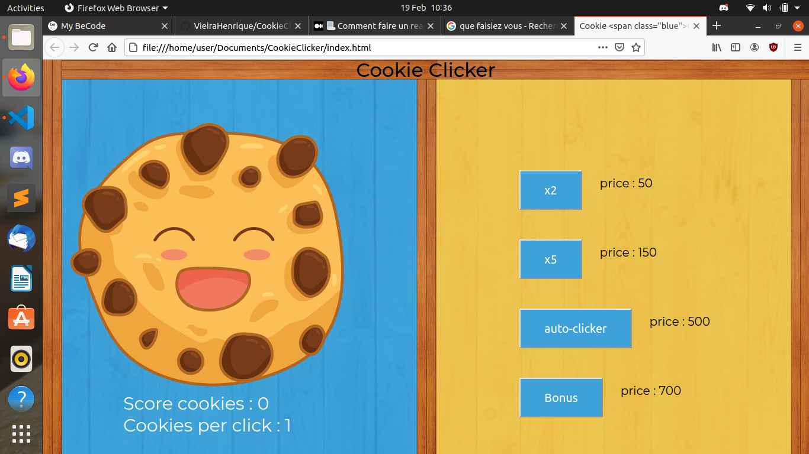

# CookieClicker

## Qui etait sur le projet ?

_Henrique_, _Nathanaël_, _Abderrahman_, _Philippe_.

## Qu'est ce que c'est ?

C'est un cookie clicker, un petit jeu fais en **javascript** où le but est simplement de clicker et d obtenir des points, pour pouvoir acheter des bonus qui nous donne encore plus de points.

## Quand avez vous bossez dessus ?

En Octobre 2020.

## Que faisiez vous ?

Ce projet a été réalise dans le cadre de notre formation de web developpeur a **Becode**.

## A quoi cela ressemble t il ?

## Devons nous installer quelques choses ?

Absolument pas vous avez juste besoin de cliquer sur ce lien : **https://vieirahenrique.github.io/CookieClicker/**.

## D'où cela vient ?

Ceci a été un exercice réalisé dans le cadre de notre formation.
